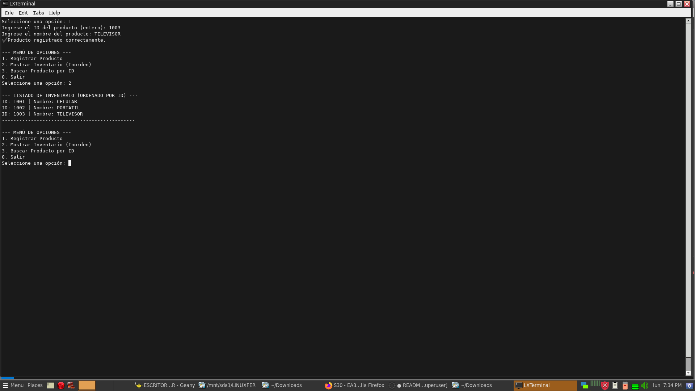
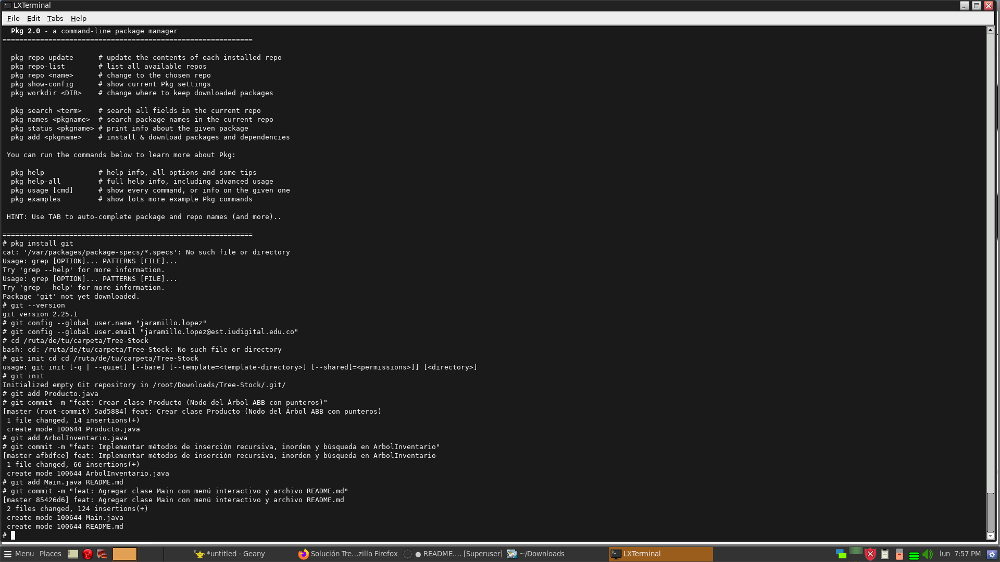

# Tree-Stock 🌳📦

Sistema de gestión de inventario para control de stock desarrollado en Java, utilizando una estructura de datos de **Árbol Binario de Búsqueda (ABB)** para optimizar las operaciones de inserción, búsqueda y recorrido ordenado.

---

## 👨‍💻 Autor
* **Desarrollador:** Fernando Jaramillo López
* **Lenguaje:** Java (JDK 17)

---

## 🏗️ Estructura del Proyecto

El sistema está desarrollado bajo el paradigma de programación orientada a objetos en 3 clases principales:

1. **`Producto.java`**: Representa el nodo del árbol con sus atributos (`id`, `nombre`, `cantidad`, `precio`) y referencias a los nodos hijo (`izquierdo`, `derecho`).
2. **`ArbolInventario.java`**: Contiene la lógica del Árbol Binario de Búsqueda (inserción recursiva, recorrido **Inorden** para listar elementos de menor a mayor por ID y búsqueda recursiva).
3. **`Main.java`**: Interfaz de consola mediante menú interactivo para la interacción con el usuario.

---

## 🚀 Instrucciones de Ejecución

### 1. Clonar el repositorio
Abre tu terminal y clona el proyecto localmente:
```bash
git clone [https://github.com/jaramillolopez/Tree-Stock.git](https://github.com/jaramillolopez/Tree-Stock.git)
cd Tree-Stock
## 📸 Evidencias de Funcionamiento

### Búsqueda de Productos


### Inventario Ordenado (Inorden)


### Actualizaciones y Configuración


Estructura del Proyecto

Tree-Stock/
├── Producto.java
├── ArbolInventario.java
├── Main.java
├── CAPTURAS/
│   ├── BUSCARPRODUCTO.png
│   ├── LISTADOINVENTARIO.png
│   └── ACTUALIZACIONREADME.png
└── README.md

# Tree-Stock

Sistema de Gestión de Inventario en Java utilizando un Árbol de Búsqueda Binaria (BST).

## 🎥 Video de Sustentación
* 🎬 **Ver Video en YouTube:** https://youtu.be/WS3bN7ca2v0

---

## 📸 Evidencias de Funcionamiento

### Búsqueda de Productos


### Inventario Ordenado (Inorden)


### Actualizaciones y Configuración


